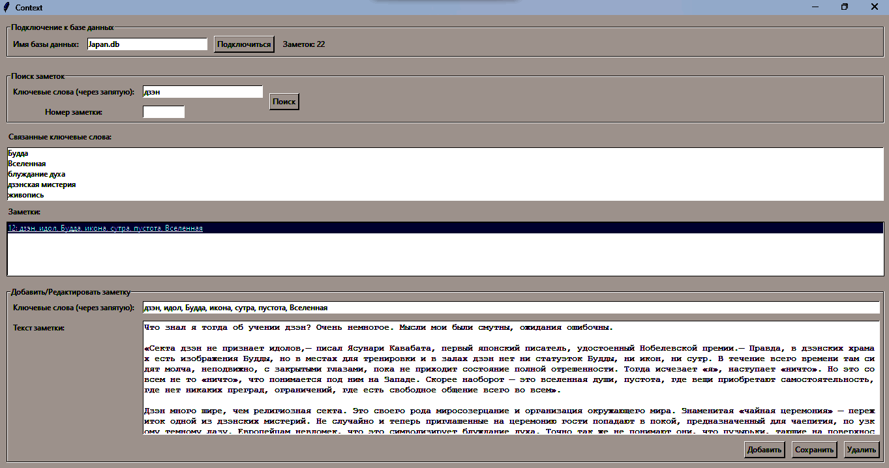
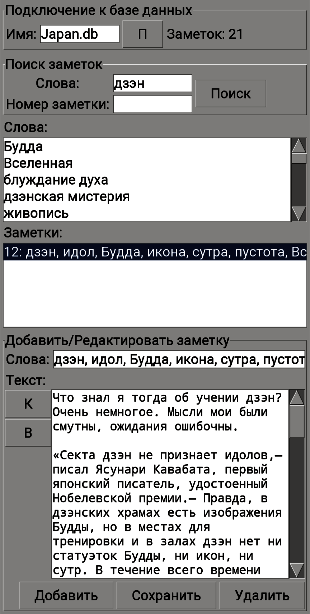

# Context

Program for maintaining personal archives

Context is a program for keeping a personal diary and archive and is built on the principle of data tagging. In it, keywords are added separated by commas, then comes the text of the note, then the note is entered into the database. Then a search is carried out by tag and related tags or note number. So with each tag, the related tags will be displayed and then the related notes. You can connect to existing databases in the "db" folder or create new databases. Enjoy using it! 
 
The program also works on a mobile phone (context_mobile.py) using a Python interpreter (for Android it is PyDroid).
 
 

Программа для ведения личных архивов

Context является программой для ведения личного дневника и архива и построена на принципе тегирования данных. В ней ключевые слова добавляются через запятую, потом идёт текст заметки, потом заметка заносится в базу данных. Дальше осуществляется поиск по тегу и связанным с ним тегами или номеру заметки. Так с каждым тегом отобразятся связанные с ним теги и затем связанные с этими тегами заметки. Можно подключаться к существующим базам данных в папке "db" или создавать новые базы данных. Приятного использования! 
 
Программа работает и на мобильном телефоне (context_mobile.py) с помощью интерпретатора Python (для Android это PyDroid).
 
 
 

